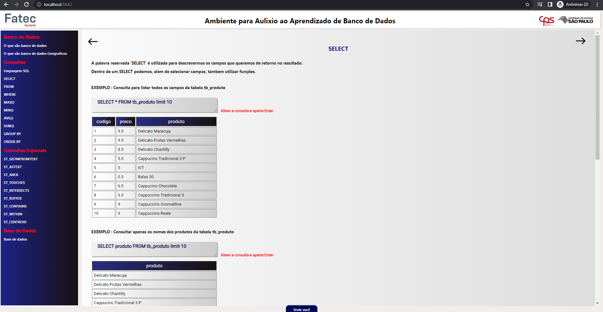
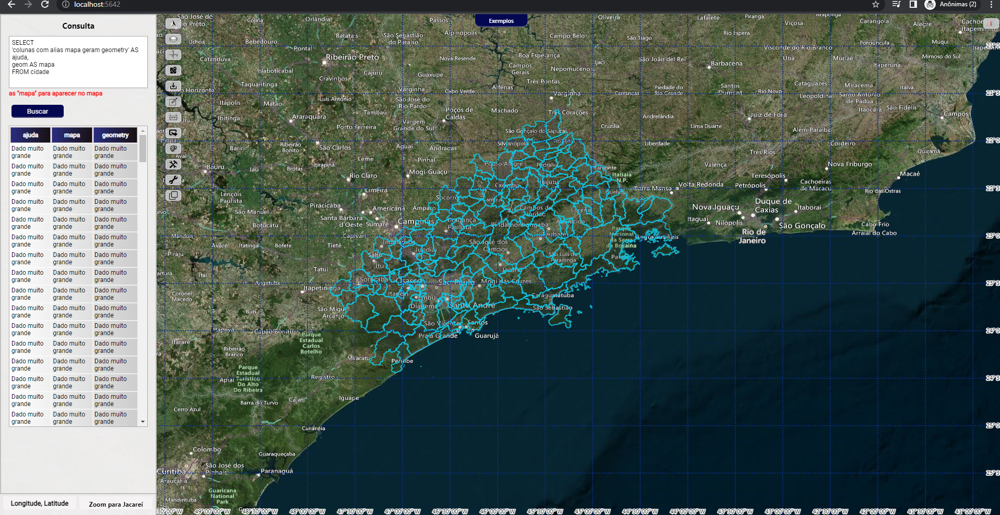

# Trabalho de conclusão de curso Fatec-Jacarei

Trabalho de conclusão de curso em Geoprocessamento.

## INSTAÇÃO

Clone este repositorio e execute o comando ```node server [--create-database] ``` para executar a aplicação.

[--create-database] - para criar o banco de dados






```

## License
[MIT](https://choosealicense.com/licenses/mit/)
